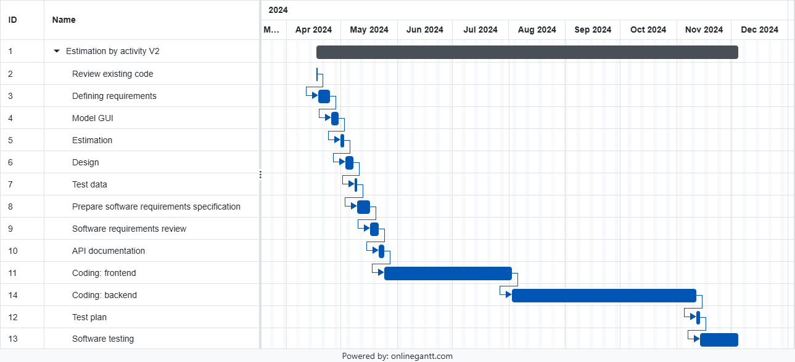

# Project Estimation - FUTURE

Date: 2024-05-03

Version: 1.0

# Estimation approach

Consider the EZElectronics project in FUTURE version (as proposed by your team in requirements V2), assume that you are going to develop the project INDEPENDENT of the deadlines of the course, and from scratch (not from V1)

# Estimate by size

### Details
To compute NC and AVG LOC per class, we have considered the following classes:
1) Manager (300 LOC)
2) Customer (300 LOC)
3) Admin (300 LOC)
4) User (300 LOC)
5) Catalogue (300 LOC)
6) Cart (300 LOC)
7) Product (300 LOC)
8) Order (300 LOC)
9) Feedback (300 LOC)
10) CartHandler (500 LOC)
11) CatalogueHandler (500 LOC)
12) ProductHandler (500 LOC)
13) AuthenticatorHandler (500 LOC)
14) OrderHandler (500 LOC)
15) FeedbackHandler (500 LOC)

> Average size per class = (300\*9 + 500\*6) / 15 = 380 LOC

|                                                                                                         | Estimate  |
| ------------------------------------------------------------------------------------------------------- | --------- |
| NC = Estimated number of classes to be developed                                                        | 15        |
| A = Estimated average size per class, in LOC                                                            | 380 LOC   |
| B = Estimated size of frontend, in LOC                                                                  | 4000 LOC  |
| D = Estimated size of requirement document, in LOC                                                      | 831 LOC   |
| F = Estimated size of API document, in LOC                                                              | 387 LOC   |
| G = Estimated size of tests, in LOC                                                                     | 1200 LOC  |
| S = Estimated size of project, in LOC (= NC\*A+B+D+F+G)                                                       | 12118 LOC |
| E = Estimated effort, in person hours (here use productivity 10 LOC per person hour)                    | 1211.8 PH |
| C = Estimated cost, in euro (here use 1 person hour cost = 30 euro)                                     | 36354 €   |
| Estimated calendar time, in calendar weeks (Assume team of 4 people, 8 hours per day, 5 days per week ) | 7.6 weeks |

# Estimate by product decomposition

###

| component name       | Estimated effort (person hours) |
| -------------------- | ------------------------------- |
| requirement document | 60                              |
| GUI prototype        | 20                              |
| design document      | 24                              |
| code: frontend       | 400                             |
| code: backend        | 570                             |
| unit tests           | 80                              |
| api tests            | 50                              |
| management documents | 26                              |

# Estimate by activity decomposition

###

| Activity name                               | Estimated effort (person hours) |
| ------------------------------------------- | ------------------------------- |
| Review existing code                        | 8                               |
| Defining requirements                       | 40                              |
| Model GUI                                   | 20                              |
| Estimation                                  | 16                              |
| Design                                      | 24                              |
| Test data                                   | 14                              |
| Prepare software requirements specification | 40                              |
| Software requirements review                | 20                              |
| API documentation                           | 24                              |
| Coding: frontend                            | 400                             |
| Coding: backend                             | 570                             |
| Test plan                                   | 15                              |
| Software testing                            | 120                             |

###

# Summary

Report here the results of the three estimation approaches. The estimates may differ. Discuss here the possible reasons for the difference

How we computed estimated duration: we have divided the effort in person-hours by the number of team members (4)

|                                    | Estimated effort | Estimated duration |
| ---------------------------------- | ---------------- | ------------------ |
| estimate by size                   | 1211.8 PH        | 303 h              |
| estimate by product decomposition  | 1230 PH          | 307.5 h            |
| estimate by activity decomposition | 1311 PH          | 327.8 h            |
