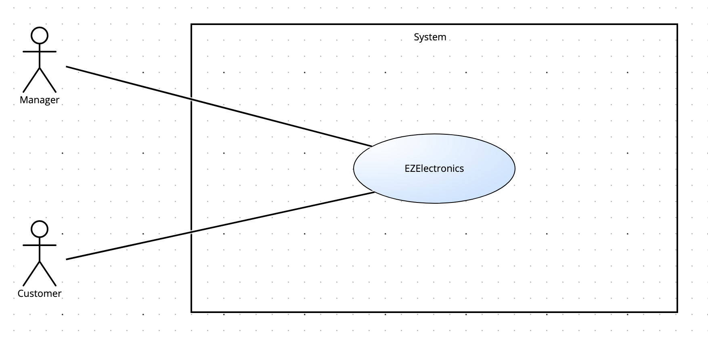
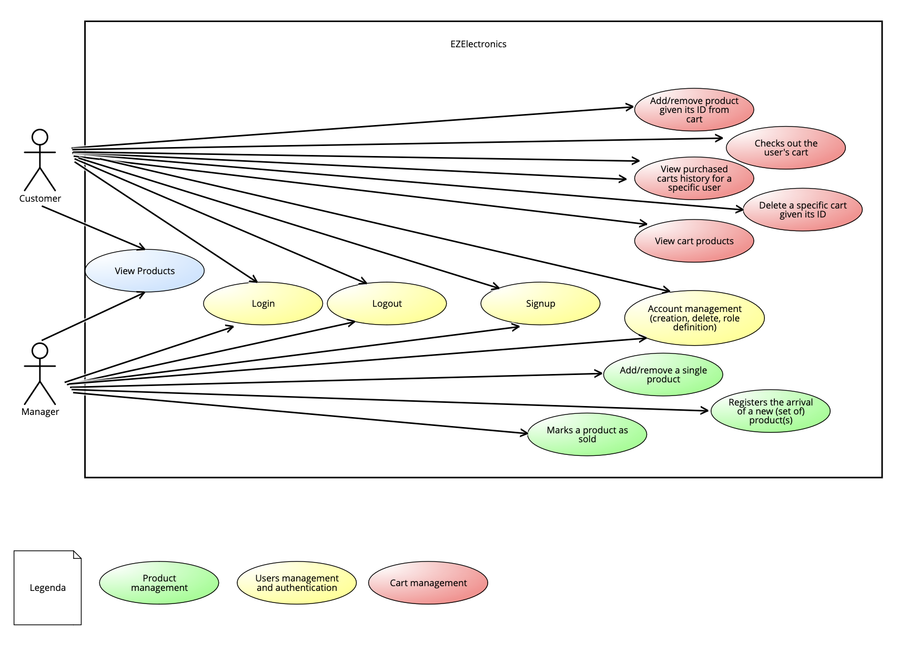
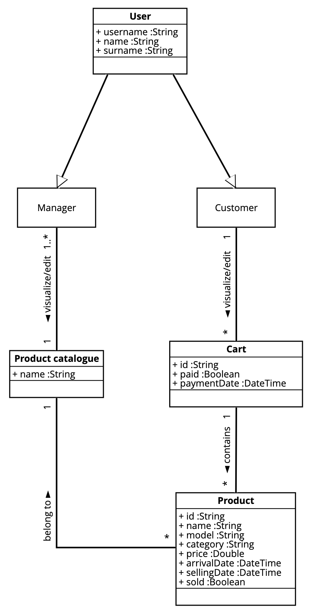
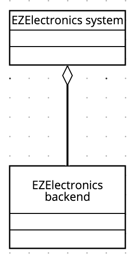
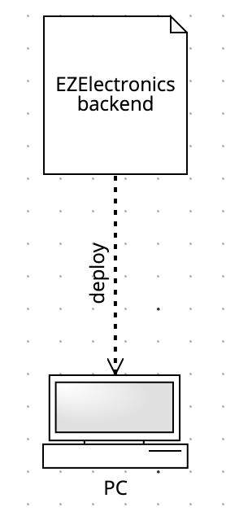

# Requirements Document - current EZElectronics

Date:

Version: V1 - description of EZElectronics in CURRENT form (as received by teachers)

| Version number |                                   Change                                   |
| :------------: | :------------------------------------------------------------------------: |
|      1.0       |                               initial commit                               |
|      1.1       |         added functional requirements, interfaces and stakeholders         |
|      1.2       |    added context diagram, class diagram and non-functional requirements    |
|      1.3       |      added stories and personas, deployment diagram and system design      |
|      1.4       |                added use case diagram and updated Timesheet                |
|      1.5       |       added use case and relative scenarios and fixed class diagram        |
|      1.6       | small changes to functional requirement and use case diagram. Added GUI V1 |
|      1.7       |                      updated GUI V1 and class diagram                      |

# Contents

- [Requirements Document - current EZElectronics](#requirements-document---current-ezelectronics)
- [Contents](#contents)
- [Informal description](#informal-description)
- [Stakeholders](#stakeholders)
- [Context Diagram and interfaces](#context-diagram-and-interfaces)
  - [Context Diagram](#context-diagram)
  - [Interfaces](#interfaces)
- [Stories and personas](#stories-and-personas)
- [Functional and non functional requirements](#functional-and-non-functional-requirements)
  - [Functional Requirements](#functional-requirements)
  - [Non Functional Requirements](#non-functional-requirements)
- [Use case diagram and use cases](#use-case-diagram-and-use-cases)
  - [Use case diagram](#use-case-diagram)
    - [Use case 1, UC1](#use-case-1-uc1)
      - [Scenario 1.1](#scenario-11)
      - [Scenario 1.2](#scenario-12)
      - [Scenario 1.3](#scenario-13)
      - [Scenario 1.4](#scenario-14)
    - [Use case 2, UC2](#use-case-2-uc2)
      - [Scenario 2.1](#scenario-21)
      - [Scenario 2.2](#scenario-22)
      - [Scenario 2.3](#scenario-23)
      - [Scenario 2.4](#scenario-24)
      - [Scenario 2.5](#scenario-25)
      - [Scenario 2.6](#scenario-26)
    - [Use case 3, UC3](#use-case-3-uc3)
      - [Scenario 3.1](#scenario-31)
      - [Scenario 3.2](#scenario-32)
    - [Use case 4, UC4](#use-case-4-uc4)
      - [Scenario 4.1](#scenario-41)
      - [Scenario 4.2](#scenario-42)
      - [Scenario 4.3](#scenario-43)
      - [Scenario 4.4](#scenario-44)
      - [Scenario 4.5](#scenario-45)
    - [Use case 5, UC5](#use-case-5-uc5)
      - [Scenario 5.1](#scenario-51)
      - [Scenario 5.2](#scenario-52)
      - [Scenario 5.3](#scenario-53)
      - [Scenario 5.4](#scenario-54)
    - [Use case 6, UC6](#use-case-6-uc6)
      - [Scenario 6.1](#scenario-61)
      - [Scenario 6.2](#scenario-62)
      - [Scenario 6.3](#scenario-63)
- [Glossary](#glossary)
- [System Design](#system-design)
- [Deployment Diagram](#deployment-diagram)

# Informal description

EZElectronics (read EaSy Electronics) is a software application designed to help managers of electronics stores to manage their products and offer them to customers through a dedicated website. Managers can assess the available products, record new ones, and confirm purchases. Customers can see available products, add them to a cart and see the history of their past purchases.

# Stakeholders

| Stakeholder name |                Description                |
| :--------------: | :---------------------------------------: |
|     Manager      | User who can modify the product catalogue |
|     Customer     | User who can buy from EZElectronics store |
|    SW factory    |    Developer of EZElectronics website     |

# Context Diagram and interfaces

## Context Diagram

## Interfaces

|  Actor   |                         Logical Interface                          | Physical Interface |
| :------: | :----------------------------------------------------------------: | :----------------: |
| Customer |                      GUI (standard features)                       |         PC         |
| Manager  | GUI (standard features and insert/update/delete products for sale) |         PC         |

# Stories and personas

1. A 45 years old man is the manager of EZelectronics store, and wants to expand his business, so he decides to sell his products online
2. A woman, age 32, is really busy with work and to spare time, decides that she is going to buy products she needs online
3. A university student, age 22, with many passions and projects, decides to try buying online for a wide choice of products at affordable prices

# Functional and non functional requirements

## Functional Requirements

|  ID   |                         Description                         |
| :---: | :---------------------------------------------------------: |
|  FR1  |             Users management and authentication             |
| FR1.1 |                            Login                            |
| FR1.2 |                           Logout                            |
| FR1.3 |                           Signup                            |
| FR1.4 |         Account management (creation, edit, delete)         |
|  FR2  |                     Product management                      |
| FR2.1 |                 Add/remove a single product                 |
| FR2.2 |     Registers the arrival of a new (set of) product(s)      |
| FR2.3 |                   Marks a product as sold                   |
| FR2.4 |                      Get all products.                      |
| FR2.5 | Get all products of a specific category/of a specific model |
| FR2.6 |                  Get a product by its code                  |
|  FR3  |                       Cart management                       |
| FR3.1 |          Add/remove product given its ID from cart          |
| FR3.2 |                 Checks out the user's cart                  |
| FR3.3 |      View purchased carts history for a specific user       |
| FR3.4 |             Delete a specific cart given its ID             |
| FR3.5 |                     View cart products                      |

## Non Functional Requirements

|  ID  | Type (efficiency, reliability, ..) |                                                Description                                                | Refers to |
| :--: | :--------------------------------: | :-------------------------------------------------------------------------------------------------------: | :-------: |
| NFR1 |             Usability              |                                       Users must not need training                                        |  All FR   |
| NFR2 |             Efficiency             |                               All app features must be completed under 0.1s                               |  All FR   |
| NFR3 |            Reliability             |                             Users must not report more than one bug per year                              |  All FR   |
| NFR4 |            Portability             | Web app must be compatible for the following browsers: Chrome v64.0.3282, Firefox v57.0.4, Safari v12.0.1 |  All FR   |

# Table of rights

| Requirement | Customer | Manager | All |
| :---------: | :------: | :-----: | :-: |
|     F1      |          |         |  x  |
|    F1.1     |          |         |  x  |
|    F1.2     |          |         |  x  |
|    F1.3     |          |         |  x  |
|    F1.4     |          |         |  x  |
|     F2      |          |    x    |     |
|    F2.1     |          |    x    |     |
|    F2.2     |          |    x    |     |
|    F2.3     |          |    x    |     |
|    F2.4     |          |         |  x  |
|    F2.5     |          |         |  x  |
|    F2.6     |          |         |  x  |
|     F3      |    x     |         |     |
|    F3.1     |    x     |         |     |
|    F3.2     |    x     |         |     |
|    F3.3     |    x     |         |     |
|    F3.4     |    x     |         |     |
|    F3.5     |    x     |         |     |

# Use case diagram and use cases

## Use case diagram

### Use case 1, UC1: User Login

| Actors Involved  |                  User                  |
| :--------------: | :------------------------------------: |
|   Precondition   | User is not logged in, user registered |
|  Post condition  |           User is logged in            |
| Nominal Scenario |              Scenario 1.1              |
|     Variants     |                  None                  |
|    Exceptions    |         Scenario 1.2, 1.3, 1.4         |

##### Scenario 1.1

|  Scenario 1.1  |                           Login                            |
| :------------: | :--------------------------------------------------------: |
|  Precondition  |            User not logged in, user registered             |
| Post condition |                       User logged in                       |
|     Step#      |                        Description                         |
|       1        |             System: ask username and password              |
|       2        |        User: provide correct username and password         |
|       3        |        System: read provided username and password         |
|       4        |    System:check if username and password provided exist    |
|       5        | System: username and password match, user is authenticated |

##### Scenario 1.2

|  Scenario 1.2  |                            Wrong password                             |
| :------------: | :-------------------------------------------------------------------: |
|  Precondition  |                  User not logged in, user registered                  |
| Post condition |                          User not logged in                           |
|     Step#      |                              Description                              |
|       1        |                   System: ask username and password                   |
|       2        |                  User: provide username or password                   |
|       3        |              System: read provided username and password              |
|       4        |         System: check if username and password provided exist         |
|       5        | System: username and password do not match, user is not authenticated |

##### Scenario 1.3

|  Scenario 1.3  |                  User is not registered                  |
| :------------: | :------------------------------------------------------: |
|  Precondition  |         User not logged in, user not registered          |
| Post condition |                    User not logged in                    |
|     Step#      |                       Description                        |
|       1        |            System: ask username and password             |
|       2        |           User: provide username and password            |
|       3        |       System: read provided username and password        |
|       4        |  System: check if username and password provided exist   |
|       5        | System: username is not found, user is not authenticated |

##### Scenario 1.4

|  Scenario 1.4  |           User already logged in            |
| :------------: | :-----------------------------------------: |
|  Precondition  |       User logged in, user registered       |
| Post condition |               User logged in                |
|     Step#      |                 Description                 |
|       1        |      System: ask username and password      |
|       2        |     User: provide username and password     |
|       3        | System: read provided username and password |
|       4        |       System: return an error message       |

### Use case 2, UC2: User registration

| Actors Involved  |                 User                 |
| :--------------: | :----------------------------------: |
|   Precondition   |        User is not registered        |
|  Post condition  | User is registered and authenticated |
| Nominal Scenario |             Scenario 2.1             |
|     Variants     |                 None                 |
|    Exceptions    |             Scenario 2.2             |

##### Scenario 2.1

|  Scenario 2.1  |                                    Registration                                     |
| :------------: | :---------------------------------------------------------------------------------: |
|  Precondition  |                               User is not registered                                |
| Post condition |                                   User registered                                   |
|     Step#      |                                     Description                                     |
|       1        |                    User: ask to register as customer or manager                     |
|       2        |                          System: ask username and password                          |
|       3        |                         User: provide username and password                         |
|       4        |                     System: read provided username and password                     |
|       5        | System: check if provided username has not already been used in another account yet |
|       6        |  System: username has not been used yet, user is registered, store his information  |

##### Scenario 2.2

|  Scenario 2.2  |                             Username already registered                             |
| :------------: | :---------------------------------------------------------------------------------: |
|  Precondition  |                                   User registered                                   |
| Post condition |                                 Registration failed                                 |
|     Step#      |                                     Description                                     |
|       1        |                    User: ask to register as customer or manager                     |
|       2        |                          System: ask username and password                          |
|       3        |                         User: provide username and password                         |
|       4        |                     System: read provided username and password                     |
|       5        | System: check if provided username has not already been used in another account yet |
|       6        |           System: username has already been used, user is not registered            |
|       7        |                            System: Provide error message                            |

### Use case 3, UC3: Logout

| Actors Involved  |      User       |
| :--------------: | :-------------: |
|   Precondition   | User logged in  |
|  Post condition  | User logged out |
| Nominal Scenario |  Scenario 3.1   |
|     Variants     |      None       |
|    Exceptions    |  Scenario 3.2   |

##### Scenario 3.1

|  Scenario 3.1  |                 Logout                  |
| :------------: | :-------------------------------------: |
|  Precondition  |             User logged in              |
| Post condition |             User logged out             |
|     Step#      |               Description               |
|       1        |           User: ask to logout           |
|       2        |            System: find user            |
|       4        | System: redirect user to the login page |

##### Scenario 3.2

|  Scenario 3.2  |           User already logged out           |
| :------------: | :-----------------------------------------: |
|  Precondition  |               User logged out               |
| Post condition |               User logged out               |
|     Step#      |                 Description                 |
|       1        |             User: ask to logout             |
|       2        |              System: find user              |
|       4        | System: User not logged, show error message |

### Use case 4, UC4: Cart management

| Actors Involved  |                                Customer                                 |
| :--------------: | :---------------------------------------------------------------------: |
|   Precondition   |                           Customer logged in                            |
|  Post condition  | Product added/removed to cart, Cart checkout, Cart History, Delete Cart |
| Nominal Scenario |                    Scenario 4.1, 4.2, 4.3, 4.4, 4.5                     |
|     Variants     |                                  None                                   |
|    Exceptions    |                                  None                                   |

##### Scenario 4.1

|  Scenario 4.1  |             Add product to cart              |
| :------------: | :------------------------------------------: |
|  Precondition  |              Customer logged in              |
| Post condition |            Product added to cart             |
|     Step#      |                 Description                  |
|       1        |        Customer: search for a product        |
|       2        | Customer: ask to add the product to the cart |
|       3        | System: add the product to the Customer cart |

##### Scenario 4.2

|  Scenario 4.2  |                       Remove product from cart                        |
| :------------: | :-------------------------------------------------------------------: |
|  Precondition  |                          Customer logged in                           |
| Post condition |                     Product removed from the cart                     |
|     Step#      |                              Description                              |
|       1        |                 Customer: ask to view cart's products                 |
|       2        |            System: retrieve cart's products and show them             |
|       3        |            Customer: ask to remove a product from the cart            |
|       4        | System: remove the selected product from the customer cart and update |

##### Scenario 4.3

|  Scenario 4.3  |                                         Cart checkout                                          |
| :------------: | :--------------------------------------------------------------------------------------------: |
|  Precondition  |                                       Customer logged in                                       |
| Post condition |                               Purchased all products in the cart                               |
|     Step#      |                                          Description                                           |
|       1        |                                    Customer: open the cart                                     |
|       2        |                               Customer: ask to purchase the cart                               |
|       3        |        System: ask to insert order information (shipping address, payment type, etc...)        |
|       4        |              System: wait for the end of the chosen payment provider transaction               |
|       5        |                       System: print a message of successful transaction                        |
|       5        | System: save the cart content in cart-history, flag it as purchased and empty the current cart |

##### Scenario 4.4

|  Scenario 4.4  |                                           Show history of past purchased carts                                           |
| :------------: | :----------------------------------------------------------------------------------------------------------------------: |
|  Precondition  |                                                    Customer logged in                                                    |
| Post condition |                                                  Cart history displayed                                                  |
|     Step#      |                                                       Description                                                        |
|       1        |                                                 Customer: open the cart                                                  |
|       2        |                                      Customer: asks to display past purchased carts                                      |
|       3        | System: retrieves all cart associated to the user, except the current one. Sort them in decending order of purchase date |
|       4        |                                               System: display cart history                                               |

##### Scenario 4.5

|  Scenario 4.5  |                        Delete Cart                        |
| :------------: | :-------------------------------------------------------: |
|  Precondition  |                    Customer logged in                     |
| Post condition |                      Cart is deleted                      |
|     Step#      |                        Description                        |
|       1        |           Customer: asks to delete current cart           |
|       2        | System: retrieves the current cart associeted to the user |
|       3        |                  System: delete the cart                  |

### Use case 5, UC5: Catalogue management

| Actors Involved  |                                        Manager                                         |
| :--------------: | :------------------------------------------------------------------------------------: |
|   Precondition   |                                   Manager logged in                                    |
|  Post condition  | Product added/removed to catalogue, new (set of) product(s) added, product marked sold |
| Nominal Scenario |                              Scenario 5.1, 5.2, 5.3, 5.4                               |
|     Variants     |                                          None                                          |
|    Exceptions    |                                          None                                          |

##### Scenario 5.1

|  Scenario 5.1  |             Add product to catalogue             |
| :------------: | :----------------------------------------------: |
|  Precondition  |                Manager logged in                 |
| Post condition |            Product added to catalogue            |
|     Step#      |                   Description                    |
|       1        |       Manager: ask to insert a new product       |
|       2        |             System: ask product data             |
|       3        | Manager: ask to add the product to the catalogue |
|       4        |     System: add the product to the catalogue     |

##### Scenario 5.2

|  Scenario 5.2  |             Remove product from catalogue             |
| :------------: | :---------------------------------------------------: |
|  Precondition  |                   Manager logged in                   |
| Post condition |           Product removed to the catalogue            |
|     Step#      |                      Description                      |
|       1        |              Manager: open the catalogue              |
|       2        |  Manager: ask to remove a product from the catalogue  |
|       3        | System: remove the product from the Manager catalogue |

##### Scenario 5.3

|  Scenario 5.3  |               Add new sets of product to catalogue                |
| :------------: | :---------------------------------------------------------------: |
|  Precondition  |                         Manager logged in                         |
| Post condition |               New set of product added to catalogue               |
|     Step#      |                            Description                            |
|       1        |   Manager: ask to insert a new set of product to the catalogue    |
|       2        |                  System: ask set of product data                  |
|       3        |                      Manager: provides data                       |
|       4        | System: read the data and add the set of product to the catalogue |

##### Scenario 5.4

|  Scenario 5.4  |                             Mark product as sold                              |
| :------------: | :---------------------------------------------------------------------------: |
|  Precondition  |                               Manager logged in                               |
| Post condition |                            Product marked as sold                             |
|     Step#      |                                  Description                                  |
|       1        |           Manager: ask to mark a product as sold into the catalogue           |
|       2        |                           System: ask product data                            |
|       3        |                        Manager: provides product data                         |
|       3        | System: read the data provided and add the product as marked to the catalogue |

### Use case 6, UC6: Products search

| Actors Involved  |                                             Users (Customers and Managers)                                              |
| :--------------: | :---------------------------------------------------------------------------------------------------------------------: |
|   Precondition   |                                                     User logged in                                                      |
|  Post condition  | Products list displayed, Returns all products of a specific category/of a specific model, Returns a product by its code |
| Nominal Scenario |                                                 Scenario 6.1, 6.2, 6.3                                                  |
|     Variants     |                                                          None                                                           |
|    Exceptions    |                                                          None                                                           |

##### Scenario 6.1

|  Scenario 6.1  |                  Show products list                  |
| :------------: | :--------------------------------------------------: |
|  Precondition  |                    User logged in                    |
| Post condition |               Products list displayed                |
|     Step#      |                     Description                      |
|       1        |          User: ask to search for a product.          |
|       2        | System: find all products belonging to the catalogue |
|       3        |          System: display the products list           |

##### Scenario 6.2

|  Scenario 6.2  |                   Show products list given a category/model                   |
| :------------: | :---------------------------------------------------------------------------: |
|  Precondition  |                                User logged in                                 |
| Post condition |                            Products list displayed                            |
|     Step#      |                                  Description                                  |
|       1        |        User: ask to search for a product specifying category or model         |
|       2        | System: find all products belonging to the catalogue that matches user search |
|       3        |                       System: display the products list                       |

##### Scenario 6.3

|  Scenario 6.3  |                         Show product given its code                          |
| :------------: | :--------------------------------------------------------------------------: |
|  Precondition  |                                User logged in                                |
| Post condition |                              Product displayed                               |
|     Step#      |                                 Description                                  |
|       1        |                 User: search for a product specifying its ID                 |
|       2        | System: find the product belonging to the catalogue that matches user search |
|       3        |                      System: display the products list                       |

# Glossary

# System Design

# Deployment Diagram

