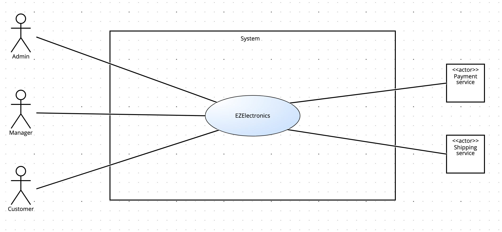
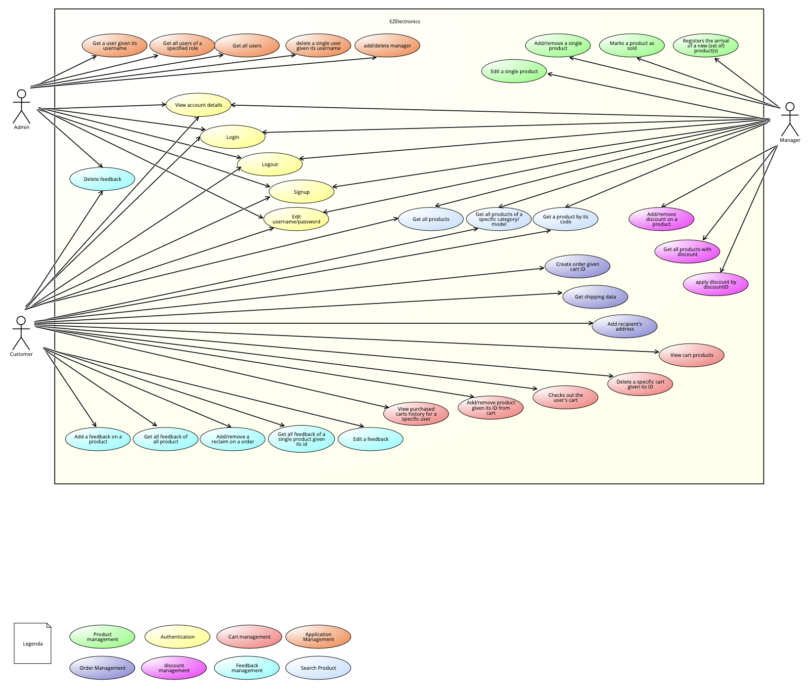
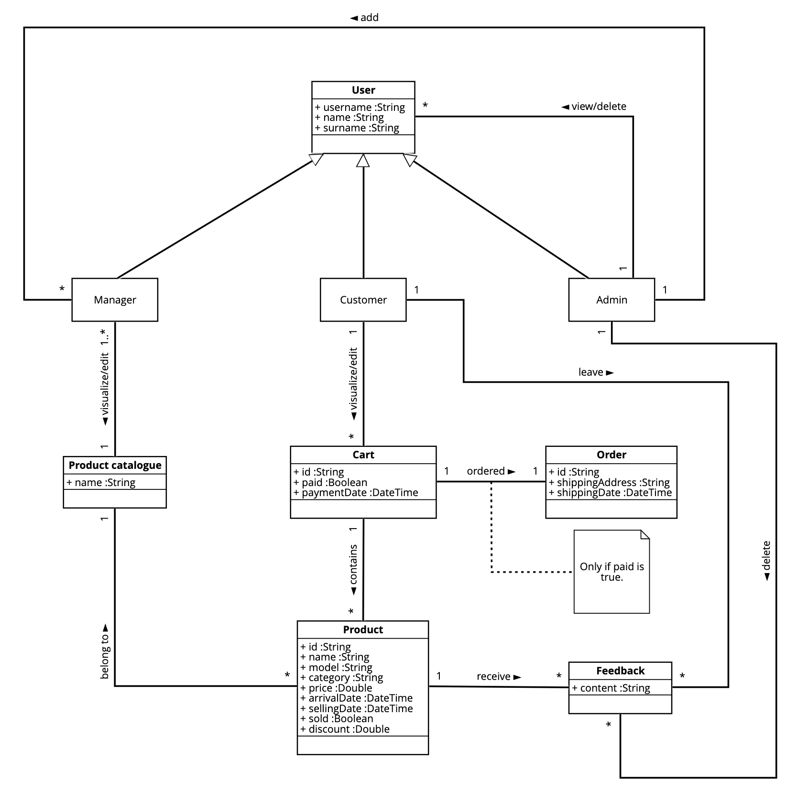

# Requirements Document - future EZElectronics

Date:

Version: V1 - description of EZElectronics in FUTURE form (as proposed by the team)

| Version number |                                Change                                |
| :------------: | :------------------------------------------------------------------: |
|      1.0       |                            initial commit                            |
|      1.1       |      added stakeholders, interfaces and functional requirements      |
|      1.2       |                 added use case scenarios and GUI V2                  |
|      1.3       | updated functional requirements and scenario for manager application |
|      1.4       |                added class diagram and updated GUI V2                |
|      1.5       |    added deployment diagram, system design and updated Timesheet     |

# Contents

- [Requirements Document - future EZElectronics](#requirements-document---future-ezelectronics)
- [Contents](#contents)
- [Informal description](#informal-description)
- [Stakeholders](#stakeholders)
- [Context Diagram and interfaces](#context-diagram-and-interfaces)
  - [Context Diagram](#context-diagram)
  - [Interfaces](#interfaces)
- [Stories and personas](#stories-and-personas)
- [Functional and non functional requirements](#functional-and-non-functional-requirements)
  - [Functional Requirements](#functional-requirements)
  - [Non Functional Requirements](#non-functional-requirements)
- [Use case diagram and use cases](#use-case-diagram-and-use-cases)
  - [Use case diagram](#use-case-diagram)
    - [Use case 1, UC1](#use-case-1-uc1)
      - [Scenario 1.1](#scenario-11)
      - [Scenario 1.2](#scenario-12)
      - [Scenario 1.3](#scenario-13)
      - [Scenario 1.4](#scenario-14)
    - [Use case 2, UC2](#use-case-2-uc3)
      - [Scenario 2.1](#scenario-21)
      - [Scenario 2.2](#scenario-22)
      - [Scenario 2.3](#scenario-23)
    - [Use case 3, UC3](#use-case-3-uc3)
      - [Scenario 3.1](#scenario-31)
      - [Scenario 3.2](#scenario-32)
    - [Use case 4, UC4](#use-case-4-uc4)
      - [Scenario 4.1](#scenario-41)
      - [Scenario 4.2](#scenario-42)
      - [Scenario 4.3](#scenario-43)
    - [Use case 5, UC5](#use-case-5-uc5)
      - [Scenario 5.1](#scenario-51)
      - [Scenario 5.2](#scenario-52)
      - [Scenario 5.3](#scenario-53)
      - [Scenario 5.4](#scenario-54)
      - [Scenario 5.5](#scenario-55)
      - [Scenario 5.6](#scenario-56)
    - [Use case 6, UC6](#use-case-6-uc6)
      - [Scenario 6.1](#scenario-61)
      - [Scenario 6.2](#scenario-62)
      - [Scenario 6.3](#scenario-63)
      - [Scenario 6.4](#scenario-64)
    - [Use case 7, UC7](#use-case-7-uc7)
      - [Scenario 7.1](#scenario-71)
      - [Scenario 7.2](#scenario-72)
      - [Scenario 7.3](#scenario-73)
      - [Scenario 7.4](#scenario-74)
    - [Use case 8, UC8](#use-case-8-uc8)
      - [Scenario 8.1](#scenario-81)
      - [Scenario 8.2](#scenario-82)
      - [Scenario 8.3](#scenario-83)
      - [Scenario 8.4](#scenario-84)
    - [Use case 9, UC9](#use-case-9-uc9)
      - [Scenario 9.1](#scenario-91)
      - [Scenario 9.2](#scenario-92)
      - [Scenario 9.3](#scenario-93)
      - [Scenario 9.4](#scenario-94)
      - [Scenario 9.5](#scenario-95)
    - [Use case 10, UC10](#use-case-10-uc10)
      - [Scenario 10.1](#scenario-101)
      - [Scenario 10.2](#scenario-102)
      - [Scenario 10.3](#scenario-103)
      - [Scenario 10.4](#scenario-104)
      - [Scenario 10.5](#scenario-105)
      - [Scenario 10.6](#scenario-106)
- [Glossary](#glossary)
- [System Design](#system-design)
- [Deployment Diagram](#deployment-diagram)

# Informal description

EZElectronics (read EaSy Electronics) is a software application designed to help managers of electronics stores to manage their products and offer them to customers through a dedicated website. Managers can assess the available products, record new ones, and confirm purchases. Customers can see available products, add them to a cart and see the history of their past purchases.

# Stakeholders

| Stakeholder name |                Description                |
| :--------------: | :---------------------------------------: |
|      Admin       |        User with higher privilege         |
|     Manager      | User who can modify the product catalogue |
|     Customer     | User who can buy from EZElectronics store |
|    SW factory    |    Developer of EZElectronics website     |
| Payment service  |  Service that manage the payment process  |
| Shipping service | Service that manage the shipping process  |

# Context Diagram and interfaces

## Context Diagram

## Interfaces

|      Actor       |                          Logical Interface                          | Physical Interface |
| :--------------: | :-----------------------------------------------------------------: | :----------------: |
|      Admin       | GUI (custom dashbord to add/delete user accounts with manager role) |         PC         |
|     Manager      |                 GUI (product catalogue management)                  |         PC         |
|     Customer     |              GUI (purchasing products from catalogue)               |         PC         |
| Payment service  |                          www.paypal.com/it                          |      Internet      |
| Shipping service |                             www.gls.it                              |      Internet      |

# Stories and personas

1. Luigi, 45 years old, is the manager of EZelectronics store, and wants to expand his business, so he decides to sell his products online
2. Pina, 32 years old, is really busy with work and to spare time, decides that she is going to buy products she needs online
3. Michele, 22 years old, is a university student with many passions and projects, decides to try buying online for a wide choice of products at affordable prices
4. Leo, 27 years old, is a lawyer. He decides he wants to buy a new smartphone for his girlfriend using a software application. Leo opens the applications, selects the product he wants to buy, and puts it in his cart.
5. Peppe, 55 years old, is the administrator of the software application. Peppe decides who can be a manager seeing the job application and uses his supervisory privileges to remove offensive feedback
6. Gianfranco, 48 years old, receives a new set of product and decides to register some products with discounts

# Functional and non functional requirements

## Functional Requirements

|  ID   |                    Description                     |
| :---: | :------------------------------------------------: |
|  FR1  |       Authentication and account management        |
| FR1.1 |                       Login                        |
| FR1.2 |                       Logout                       |
| FR1.3 |                       Signup                       |
| FR1.4 |               Edit username/password               |
| FR1.5 |                View account details                |
|  FR2  |                 Product management                 |
| FR2.1 |            Add/remove a single product             |
| FR2.2 |               Edit a single product                |
| FR2.3 | Registers the arrival of a new (set of) product(s) |
| FR2.4 |              Marks a product as sold               |
|  FR3  |                  Cart management                   |
| FR3.1 |     Add/remove product given its ID from cart      |
| FR3.2 |             Checks out the user's cart             |
| FR3.3 |  View purchased carts history for a specific user  |
| FR3.4 |               Empty the current cart               |
| FR3.5 |                 View cart products                 |
|  FR4  |               Application management               |
| FR4.1 |             Add user with manager role             |
| FR4.2 |      Get a specified user given its username       |
| FR4.3 |         Get all users of a specified role          |
| FR4.4 |                   Get all users                    |
| FR4.5 |      Delete a single user given its username       |
|  FR5  |                  Order Management                  |
| FR5.1 |             Create order given cart ID             |
| FR5.2 |                 Get shipping data                  |
| FR5.3 |              Add recipient's address               |
|  FR6  |                Discount Management                 |
| FR6.1 |          Add/remove discount on a product          |
|  FR7  |                Feedback Management                 |
| FR7.1 |            Add a feedback on a product             |
| FR7.2 |          Get all feedback of all product           |
| FR7.3 | Get all feedback of a single product given its ID  |
| FR7.4 |                   Edit feedback                    |
| FR7.5 |                  Delete feedback                   |
|  FR8  |                  Search products                   |
| FR8.1 |                  Get all products                  |
| FR8.2 |   Get all products of a specific category/model    |
| FR8.3 |              Get a product by its ID               |
| FR8.4 |           Get all products with discount           |

## Non Functional Requirements

|  ID  | Type (efficiency, reliability, ...) |                                                Description                                                | Refers to |
| :--: | :---------------------------------: | :-------------------------------------------------------------------------------------------------------: | :-------: |
| NFR1 |              Usability              |                                       Users must not need training                                        |  All FR   |
| NFR2 |             Efficiency              |                               All app features must be completed under 0.1s                               |  All FR   |
| NFR3 |             Reliability             |                             Users must not report more than one bug per year                              |  All FR   |
| NFR4 |             Portability             | Web app must be compatible for the following browsers: Chrome v64.0.3282, Firefox v57.0.4, Safari v12.0.1 |  All FR   |

# Table of rights

| Requirement | Customer | Manager | Admin |
| :---------: | :------: | :-----: | :---: |
|     F1      |    x     |    x    |   x   |
|    F1.1     |    x     |    x    |   x   |
|    F1.2     |    x     |    x    |   x   |
|    F1.3     |    x     |    x    |   x   |
|    F1.4     |    x     |    x    |   x   |
|    F1.5     |    x     |    x    |   x   |
|     F2      |          |    x    |       |
|    F2.1     |          |    x    |       |
|    F2.2     |          |    x    |       |
|    F2.3     |          |    x    |       |
|    F2.4     |          |    x    |       |
|     F3      |    x     |         |       |
|    F3.1     |    x     |         |       |
|    F3.2     |    x     |         |       |
|    F3.3     |    x     |         |       |
|    F3.4     |    x     |         |       |
|    F3.5     |    x     |         |       |
|     F4      |          |         |   x   |
|    F4.1     |          |         |   x   |
|    F4.2     |          |         |   x   |
|    F4.3     |          |         |   x   |
|    F4.4     |          |         |   x   |
|    F4.5     |          |         |   x   |
|     F5      |    x     |         |       |
|    F5.1     |    x     |         |       |
|    F5.2     |    x     |         |       |
|    F5.3     |    x     |         |       |
|     F6      |          |    x    |       |
|    F6.1     |          |    x    |       |
|     F7      |    x     |         |       |
|    F7.1     |    x     |         |       |
|    F7.2     |    x     |         |       |
|    F7.3     |    x     |         |       |
|    F7.4     |    x     |         |       |
|    F7.5     |    x     |         |   x   |
|     FR8     |    x     |    x    |   x   |
|    FR8.1    |    x     |    x    |   x   |
|    FR8.2    |    x     |    x    |   x   |
|    FR8.3    |    x     |    x    |   x   |
|    FR8.4    |    x     |    x    |   x   |

# Use case diagram and use cases

## Use case diagram

### Use case 1, UC1: User Login

| Actors Involved  |                  User                  |
| :--------------: | :------------------------------------: |
|   Precondition   | User is not logged in, user registered |
|  Post condition  |           User is logged in            |
| Nominal Scenario |              Scenario 1.1              |
|     Variants     |                  None                  |
|    Exceptions    |         Scenario 1.2, 1.3, 1.4         |

##### Scenario 1.1

|  Scenario 1.1  |                           Login                            |
| :------------: | :--------------------------------------------------------: |
|  Precondition  |            User not logged in, user registered             |
| Post condition |                       User logged in                       |
|     Step#      |                        Description                         |
|       1        |             System: ask username and password              |
|       2        |        User: provide correct username and password         |
|       3        |        System: read provided username and password         |
|       4        |   System: check if username and password provided exist    |
|       5        | System: username and password match, user is authenticated |

##### Scenario 1.2

|  Scenario 1.2  |                      Wrong password                      |
| :------------: | :------------------------------------------------------: |
|  Precondition  |           User not logged in, user registered            |
| Post condition |                    User not logged in                    |
|     Step#      |                       Description                        |
|       1        |            System: ask username and password             |
|       2        |            User: provide username or password            |
|       3        |       System: read provided username and password        |
|       4        |  System: check if username and password provided exist   |
|       5        | System: password do not match, user is not authenticated |
|       6        |              System: provide error message               |

##### Scenario 1.3

|  Scenario 1.3  |                  User is not registered                  |
| :------------: | :------------------------------------------------------: |
|  Precondition  |         User not logged in, user not registered          |
| Post condition |                    User not logged in                    |
|     Step#      |                       Description                        |
|       1        |            System: ask username and password             |
|       2        |           User: provide username and password            |
|       3        |       System: read provided username and password        |
|       4        |  System: check if username and password provided exist   |
|       5        | System: username do not match, user is not authenticated |
|       6        |              System: provide error message               |

##### Scenario 1.4

| Scenario 1.4   |             User already logged in              |
| -------------- | :---------------------------------------------: |
| Precondition   |         User logged in, user registered         |
| Post condition |                 User logged in                  |
| Step#          |                   Description                   |
| 1              |           System: Ask email password.           |
| 2              |         User: Provide email, password.          |
| 3              | System: check if the user is already logged in. |
| 4              |        System: provide an error message         |

### Use case 2, UC2: User registration

| Actors Involved  |                 User                 |
| :--------------: | :----------------------------------: |
|   Precondition   |        User is not registered        |
|  Post condition  | User is registered and authenticated |
| Nominal Scenario |             Scenario 2.1             |
|     Variants     |                 None                 |
|    Exceptions    |             Scenario 2.2             |

##### Scenario 2.1

|  Scenario 2.1  |                                          Customer registration                                           |
| :------------: | :------------------------------------------------------------------------------------------------------: |
|  Precondition  |                                        Customer is not registered                                        |
| Post condition |                                           Customer registered                                            |
|     Step#      |                                               Description                                                |
|       1        |                                    User: ask to register as customer                                     |
|       2        |                             System: ask name, surname, username and password                             |
|       3        |                            User: provide name, surname, username and password                            |
|       4        |                        System: read provided name, surname, username and password                        |
|       5        |           System: check if provided username has not already been used in another account yet            |
|       6        | System: username has not been used yet, user is registered and authenticated, his information are stored |

##### Scenario 2.2

|  Scenario 2.2  |                                      Manager application                                      |
| :------------: | :-------------------------------------------------------------------------------------------: |
|  Precondition  |                                 Manager application is absent                                 |
| Post condition |                                   Manager application sent                                    |
|     Step#      |                                          Description                                          |
|       1        |                                 User: apply for manager role                                  |
|       2        |                   System: ask name, surname, username, password and details                   |
|       3        |                  User: provide name, surname, username, password and details                  |
|       4        |              System: read provided name, surname, username, password and details              |
|       5        |      System: check if provided username has not already been used in another account yet      |
|       6        | System: username has not been used yet, application sent to admin, his information are stored |

##### Scenario 2.3

|  Scenario 2.3  |                             Username already registered                             |
| :------------: | :---------------------------------------------------------------------------------: |
|  Precondition  |                                   User registered                                   |
| Post condition |                                 Registration failed                                 |
|     Step#      |                                     Description                                     |
|       1        |                          User: ask to register as customer                          |
|       2        |                          System: ask username and password                          |
|       3        |                         User: provide username and password                         |
|       4        |                     System: read provided username and password                     |
|       5        | System: check if provided username has not already been used in another account yet |
|       6        |           System: username has already been used, user is not registered            |
|       7        |                            System: provide error message                            |

### Use case 3, UC3: Logout

| Actors Involved  |      User       |
| :--------------: | :-------------: |
|   Precondition   | User logged in  |
|  Post condition  | User logged out |
| Nominal Scenario |  Scenario 3.1   |
|     Variants     |      None       |
|    Exceptions    |  Scenario 3.2   |

##### Scenario 3.1

|  Scenario 3.1  |                 Logout                  |
| :------------: | :-------------------------------------: |
|  Precondition  |             User logged in              |
| Post condition |             User logged out             |
|     Step#      |               Description               |
|       1        |           User: ask to logout           |
|       2        |            System: find user            |
|       4        | System: redirect user to the login page |

##### Scenario 3.2

|  Scenario 3.2  |    User already logged out    |
| :------------: | :---------------------------: |
|  Precondition  |        User logged out        |
| Post condition |        User logged out        |
|     Step#      |          Description          |
|       1        |      User: ask to logout      |
|       2        |       System: find user       |
|       3        |    System: User not logged    |
|       4        | System: provide error message |

### Use case 4, UC4: Account management

| Actors Involved  |                        User                         |
| :--------------: | :-------------------------------------------------: |
|   Precondition   |                   User logged in                    |
|  Post condition  | Username/password change, account details displayed |
| Nominal Scenario |                  Scenario 4.1, 4.2                  |
|     Variants     |                        None                         |
|    Exceptions    |                    Scenario 4.3                     |

##### Scenario 4.1

|  Scenario 4.1  |                             Username/password change                             |
| :------------: | :------------------------------------------------------------------------------: |
|  Precondition  |                                  User logged in                                  |
| Post condition |                            Username/password changed                             |
|     Step#      |                                   Description                                    |
|       1        |                      User: ask to change username/password                       |
|       2        |                   System: ask to insert new username/password                    |
|       3        |                        User: insert new username/password                        |
|       4        | System: check if new username already exist, if not username/password is changed |

##### Scenario 4.2

|  Scenario 4.2  |                Display account details                 |
| :------------: | :----------------------------------------------------: |
|  Precondition  |                     User logged in                     |
| Post condition |               Account details displayed                |
|     Step#      |                      Description                       |
|       1        |         User: ask to see his account's details         |
|       2        | System: retrieve user account details and display them |

##### Scenario 4.3

|  Scenario 4.2  |                     Username already exist                      |
| :------------: | :-------------------------------------------------------------: |
|  Precondition  |                         User logged in                          |
| Post condition |                      Username not changed                       |
|     Step#      |                           Description                           |
|       1        |                  User: ask to change username                   |
|       2        |               System: ask to insert new username                |
|       3        |                    User: insert new username                    |
|       4        | System: username has already been used, username is not changed |
|       5        |                  System: provide error message                  |

### Use case 5, UC5: Cart management

| Actors Involved  |                                Customer                                 |
| :--------------: | :---------------------------------------------------------------------: |
|   Precondition   |                           Customer logged in                            |
|  Post condition  | Product added/removed to cart, Cart checkout, Cart History, Delete Cart |
| Nominal Scenario |                    Scenario 5.1, 5.2, 5.3, 5.4, 5.5                     |
|     Variants     |                                  None                                   |
|    Exceptions    |                              Scenario 5.6                               |

##### Scenario 5.1

|  Scenario 5.1  |             Add product to cart              |
| :------------: | :------------------------------------------: |
|  Precondition  |              Customer logged in              |
| Post condition |            Product added to cart             |
|     Step#      |                 Description                  |
|       1        |        Customer: search for a product        |
|       2        | Customer: ask to add the product to the cart |
|       3        | System: add the product to the Customer cart |

##### Scenario 5.2

|  Scenario 5.2  |                       Remove product from cart                        |
| :------------: | :-------------------------------------------------------------------: |
|  Precondition  |                          Customer logged in                           |
| Post condition |                     Product removed from the cart                     |
|     Step#      |                              Description                              |
|       1        |                 Customer: ask to view cart's products                 |
|       2        |            System: retrieve cart's products and show them             |
|       3        |            Customer: ask to remove a product from the cart            |
|       4        | System: remove the selected product from the customer cart and update |

##### Scenario 5.3

|  Scenario 5.3  |                                         Cart checkout                                          |
| :------------: | :--------------------------------------------------------------------------------------------: |
|  Precondition  |                                       Customer logged in                                       |
| Post condition |                               Purchased all products in the cart                               |
|     Step#      |                                          Description                                           |
|       1        |                                    Customer: open the cart                                     |
|       2        |                               Customer: ask to purchase the cart                               |
|       3        |        System: ask to insert order information (shipping address, payment type, etc...)        |
|       4        |              System: wait for the end of the chosen payment provider transaction               |
|       5        |                       System: print a message of successful transaction                        |
|       6        | System: save the cart content in cart-history, flag it as purchased and empty the current cart |

##### Scenario 5.4

|  Scenario 5.4  |                                           Show history of past purchased carts                                           |
| :------------: | :----------------------------------------------------------------------------------------------------------------------: |
|  Precondition  |                                                    Customer logged in                                                    |
| Post condition |                                                  Cart history displayed                                                  |
|     Step#      |                                                       Description                                                        |
|       1        |                                                 Customer: open the cart                                                  |
|       2        |                                      Customer: asks to display past purchased carts                                      |
|       3        | System: retrieves all cart associated to the user, except the current one. Sort them in decending order of purchase date |
|       4        |                                               System: display cart history                                               |

##### Scenario 5.5

|  Scenario 5.5  |                        Delete Cart                        |
| :------------: | :-------------------------------------------------------: |
|  Precondition  |                    Customer logged in                     |
| Post condition |                      Cart is deleted                      |
|     Step#      |                        Description                        |
|       1        |           Customer: asks to delete current cart           |
|       2        | System: retrieves the current cart associeted to the user |
|       3        |                  System: delete the cart                  |

##### Scenario 5.6

|  Scenario 5.6  |                                           Product already added to Cart                                           |
| :------------: | :---------------------------------------------------------------------------------------------------------------: |
|  Precondition  |                                                Customer logged in                                                 |
| Post condition |                                                 Product not added                                                 |
|     Step#      |                                                    Description                                                    |
|       1        |                                Customer: asks to add a product to the current cart                                |
|       2        |                                               System: ask productID                                               |
|       3        |                                          Customer: insert the productID                                           |
|       4        | System: check if the product is already inside the cart, product is already inside the cart, product is not added |
|       5        |                                           System: provide error message                                           |

### Use case 6, UC6: Product management

| Actors Involved  |                                        Manager                                         |
| :--------------: | :------------------------------------------------------------------------------------: |
|   Precondition   |                                   Manager logged in                                    |
|  Post condition  | Product added/removed to catalogue, new (set of) product(s) added, product marked sold |
| Nominal Scenario |                              Scenario 6.1, 6.2, 6.3, 6.4                               |
|     Variants     |                                          None                                          |
|    Exceptions    |                                          None                                          |

##### Scenario 6.1

|  Scenario 6.1  |             Add product to catalogue             |
| :------------: | :----------------------------------------------: |
|  Precondition  |                Manager logged in                 |
| Post condition |            Product added to catalogue            |
|     Step#      |                   Description                    |
|       1        |       Manager: ask to insert a new product       |
|       2        |             System: ask product data             |
|       3        | Manager: ask to add the product to the catalogue |
|       4        |     System: add the product to the catalogue     |

##### Scenario 6.2

|  Scenario 6.2  |             Remove product from catalogue             |
| :------------: | :---------------------------------------------------: |
|  Precondition  |                   Manager logged in                   |
| Post condition |           Product removed to the catalogue            |
|     Step#      |                      Description                      |
|       1        |              Manager: open the catalogue              |
|       2        |  Manager: ask to remove a product from the catalogue  |
|       3        | System: remove the product from the Manager catalogue |

##### Scenario 6.3

|  Scenario 6.3  |               Add new sets of product to catalogue                |
| :------------: | :---------------------------------------------------------------: |
|  Precondition  |                         Manager logged in                         |
| Post condition |               New set of product added to catalogue               |
|     Step#      |                            Description                            |
|       1        |   Manager: ask to insert a new set of product to the catalogue    |
|       2        |                  System: ask set of product data                  |
|       3        |                      Manager: provides data                       |
|       4        | System: read the data and add the set of product to the catalogue |

##### Scenario 6.4

|  Scenario 6.4  |                             Mark product as sold                              |
| :------------: | :---------------------------------------------------------------------------: |
|  Precondition  |                               Manager logged in                               |
| Post condition |                            Product marked as sold                             |
|     Step#      |                                  Description                                  |
|       1        |           Manager: ask to mark a product as sold into the catalogue           |
|       2        |                           System: ask product data                            |
|       3        |                        Manager: provides product data                         |
|       4        | System: read the data provided and add the product as marked to the catalogue |

### Use case 7, UC7: Products search

| Actors Involved  |                                      Users (Customers, Managers and Admin)                                      |
| :--------------: | :-------------------------------------------------------------------------------------------------------------: |
|   Precondition   |                                                 User logged in                                                  |
|  Post condition  | Products list displayed, get all products of a specific category/of a specific model, get a product by its code |
| Nominal Scenario |                                             Scenario 7.1, 7.2, 7.3                                              |
|     Variants     |                                                      None                                                       |
|    Exceptions    |                                                  Scenario 7.4                                                   |

##### Scenario 7.1

|  Scenario 7.1  |                  Show products list                  |
| :------------: | :--------------------------------------------------: |
|  Precondition  |                    User logged in                    |
| Post condition |               Products list displayed                |
|     Step#      |                     Description                      |
|       1        |          User: ask to search for a product.          |
|       2        | System: find all products belonging to the catalogue |
|       3        |          System: display the products list           |

##### Scenario 7.2

|  Scenario 7.2  |                   Show products list given a category/model                   |
| :------------: | :---------------------------------------------------------------------------: |
|  Precondition  |                                User logged in                                 |
| Post condition |                            Products list displayed                            |
|     Step#      |                                  Description                                  |
|       1        |        User: ask to search for a product specifying category or model         |
|       2        | System: find all products belonging to the catalogue that matches user search |
|       3        |                       System: display the products list                       |

##### Scenario 7.3

|  Scenario 7.3  |                         Show product given its code                          |
| :------------: | :--------------------------------------------------------------------------: |
|  Precondition  |                                User logged in                                |
| Post condition |                              Product displayed                               |
|     Step#      |                                 Description                                  |
|       1        |                 User: search for a product specifying its ID                 |
|       2        | System: find the product belonging to the catalogue that matches user search |
|       3        |                      System: display the products list                       |

##### Scenario 7.4

|  Scenario 7.4  |                                    Product not found                                    |
| :------------: | :-------------------------------------------------------------------------------------: |
|  Precondition  |                                     User logged in                                      |
| Post condition |                            Product not found, search failed                             |
|     Step#      |                                       Description                                       |
|       1        |                      User: search for a product specifying its ID                       |
|       2        | System: check if there is a product belonging to the catalogue that matches user search |
|       3        |                        System: product not found, search failed                         |
|       4        |                              System: provide error message                              |

### Use case 8, UC8: Order management

| Actors Involved  |                                 Customers                                  |
| :--------------: | :------------------------------------------------------------------------: |
|   Precondition   |                             Customer logged in                             |
|  Post condition  | Order is created, shipping data are returned, recipient's address is added |
| Nominal Scenario |                           Scenario 8.1, 8.2, 8.3                           |
|     Variants     |                                    None                                    |
|    Exceptions    |                                Scenario 8.4                                |

##### Scenario 8.1

|  Scenario 7.1  |                  Create order given a cart ID                   |
| :------------: | :-------------------------------------------------------------: |
|  Precondition  |                       Customer logged in                        |
| Post condition |                        Order is created                         |
|     Step#      |                           Description                           |
|       1        |                 Customer: ask to create a order                 |
|       2        |                       System: ask cart ID                       |
|       3        |                    Customer: insert cart ID                     |
|       4        | System: check if cart ID exists, if exists it creates the order |

##### Scenario 8.2

|  Scenario 8.2  |                      Show shipping data                       |
| :------------: | :-----------------------------------------------------------: |
|  Precondition  |                      Customer logged in                       |
| Post condition |                  Shipping data are displayed                  |
|     Step#      |                          Description                          |
|       1        |              Customer: ask to show shipping data              |
|       2        |                     System: ask order ID                      |
|       3        |                   Customer: insert order ID                   |
|       4        | System: check if order exists and if so, it displays the data |

##### Scenario 8.3

|  Scenario 8.3  |     Add recipient's address      |
| :------------: | :------------------------------: |
|  Precondition  |        Customer logged in        |
| Post condition |   Recipient's address is added   |
|     Step#      |           Description            |
|       1        | Customer: ask to add his address |
|       2        |   System: Add customer address   |

##### Scenario 8.4

|  Scenario 8.4  |                    Recipient address doesn't exist                    |
| :------------: | :-------------------------------------------------------------------: |
|  Precondition  |                          Customer logged in                           |
| Post condition |                           Order not created                           |
|     Step#      |                              Description                              |
|       1        |                   Customer: ask to create an order                    |
|       2        |                     System: ask shipping address                      |
|       3        |                Customer: insert wrong shipping address                |
|       4        | System: check if address exists, address not found, order not created |
|       5        |                     System: provide error message                     |

### Use case 9, UC8: Feedback management

| Actors Involved  |                                                             Customers, Admin                                                             |
| :--------------: | :--------------------------------------------------------------------------------------------------------------------------------------: |
|   Precondition   |                                                        Customer, Admin logged in                                                         |
|  Post condition  | Feedback is added, feedback is showed for all products, feedback is showed for a single product, feedback is edited, feedback is deleted |
| Nominal Scenario |                                                  Scenario 9.1, 9.2, 9.3, 9.4, 9.5, 9.6                                                   |
|     Variants     |                                                                   None                                                                   |
|    Exceptions    |                                                                   None                                                                   |

##### Scenario 9.1

|  Scenario 9.1  |                     Add a feedback on a product                     |
| :------------: | :-----------------------------------------------------------------: |
|  Precondition  |                         Customer logged in                          |
| Post condition |                          Feedback is added                          |
|     Step#      |                             Description                             |
|       1        |                   Customer: ask to add a feedback                   |
|       2        |                       System: ask product ID                        |
|       3        |                     Customer: insert product ID                     |
|       4        | System: check if product ID exists, if exists the feedback is added |

##### Scenario 9.2

|  Scenario 9.2  |         show all feedback of all product          |
| :------------: | :-----------------------------------------------: |
|  Precondition  |                Customer logged in                 |
| Post condition |        feedback is showed for all products        |
|     Step#      |                    Description                    |
|       1        | Customer: ask to see all feedback of all products |
|       2        |           System: displays all feedback           |

##### Scenario 9.3

|  Scenario 9.3  |           show all feedback of a single product given its id           |
| :------------: | :--------------------------------------------------------------------: |
|  Precondition  |                           Customer logged in                           |
| Post condition |                feedback is showed for a single product                 |
|     Step#      |                              Description                               |
|       1        |        Customer: ask to see all feedback of a specific product         |
|       2        |                         System: ask product ID                         |
|       3        |                      Customer: insert product ID                       |
|       4        | System: check if product ID exists, if exists it displays all feedback |

##### Scenario 9.4

|  Scenario 9.4  |                                                         Edit a feedback                                                         |
| :------------: | :-----------------------------------------------------------------------------------------------------------------------------: |
|  Precondition  |                                                       Customer logged in                                                        |
| Post condition |                                                       feedback is edited                                                        |
|     Step#      |                                                           Description                                                           |
|       1        |                                               Customer: ask to modify a feedback                                                |
|       2        |                                                     System: ask product ID                                                      |
|       3        |                                           Customer: insert product ID and feedback ID                                           |
|       4        | System: check if product ID exists, if exists and it has a feedback associated to customer's username, it modifies the feedback |

##### Scenario 9.5

|  Scenario 9.5  |                                                        Delete feedback                                                         |
| :------------: | :----------------------------------------------------------------------------------------------------------------------------: |
|  Precondition  |                                                   Customer, Admin logged in                                                    |
| Post condition |                                                      feedback is deleted                                                       |
|     Step#      |                                                          Description                                                           |
|       1        |                                               Customer: ask to delete a feedback                                               |
|       2        |                                                     System: ask product ID                                                     |
|       3        |                                                  Customer: insert product ID                                                   |
|       4        | System: check if product ID exists, if exists and it has a feedback associated to customer's username, it deletes the feedback |

### Use case 10, UC10: Application management

| Actors Involved  |                                                                       Admin                                                                        |
| :--------------: | :------------------------------------------------------------------------------------------------------------------------------------------------: |
|   Precondition   |                                                                  Admin logged in                                                                   |
|  Post condition  | Get user given its username, get all users of a specified role, get all users, delete a single user given its username, add user with manager role |
| Nominal Scenario |                                                       Scenario 10.1, 10.2, 10.3, 10.4, 10.5                                                        |
|     Variants     |                                                                        None                                                                        |
|    Exceptions    |                                                                Scenario 10.6, 10.7                                                                 |

##### Scenario 10.1

| Scenario 10.1  |                   Get user given its username                   |
| :------------: | :-------------------------------------------------------------: |
|  Precondition  |                         Admin logged in                         |
| Post condition |              User with given username is displayed              |
|     Step#      |                           Description                           |
|       1        |                    Admin: ask to search user                    |
|       2        |                      System: ask username                       |
|       3        |                     Admin: insert username                      |
|       4        | System: check if username exists, if exists it display the user |

##### Scenario 10.2

| Scenario 10.2  |           Get all users of a specified role           |
| :------------: | :---------------------------------------------------: |
|  Precondition  |                    Admin logged in                    |
| Post condition |          User with given role are displayed           |
|     Step#      |                      Description                      |
|       1        |              Admin: ask to search users               |
|       2        |                   System: ask role                    |
|       3        |                  Admin: insert role                   |
|       4        | System: display all the users with the specified role |

##### Scenario 10.3

| Scenario 10.3  |         Get all users         |
| :------------: | :---------------------------: |
|  Precondition  |        Admin logged in        |
| Post condition |      Users are displayed      |
|     Step#      |          Description          |
|       1        |  Admin: ask to search users   |
|       2        | System: display all the users |

##### Scenario 10.4

| Scenario 10.4  |              Delete single user given its username              |
| :------------: | :-------------------------------------------------------------: |
|  Precondition  |                         Admin logged in                         |
| Post condition |               User with given username is deleted               |
|     Step#      |                           Description                           |
|       1        |                    Admin: ask to delete user                    |
|       2        |                      System: ask username                       |
|       3        |                     Admin: insert username                      |
|       4        | System: check if username exists, if exists it deletes the user |

##### Scenario 10.5

| Scenario 10.5  |                      Add user with manager role                      |
| :------------: | :------------------------------------------------------------------: |
|  Precondition  |                           Admin logged in                            |
| Post condition |                  Manager request accepted or denied                  |
|     Step#      |                             Description                              |
|       1        |            Admin: ask to get all pending manager requests            |
|       2        |            System: retrieves all pending manager requests            |
|       3        | Admin: select a request and choose whether accept or not the request |
|       4        |           System: save request status (accepted or denied)           |

##### Scenario 10.6

| Scenario 10.6  |            Username not found during get/delete             |
| :------------: | :---------------------------------------------------------: |
|  Precondition  |                       Admin logged in                       |
| Post condition |                        Search failed                        |
|     Step#      |                         Description                         |
|       1        |                  Admin: ask to search user                  |
|       2        |                    System: ask username                     |
|       3        |                   Admin: insert username                    |
|       4        | System: check if username exists, the username is not found |
|       5        |                System: provide error message                |

# Glossary

# System Design

# Deployment Diagram

