
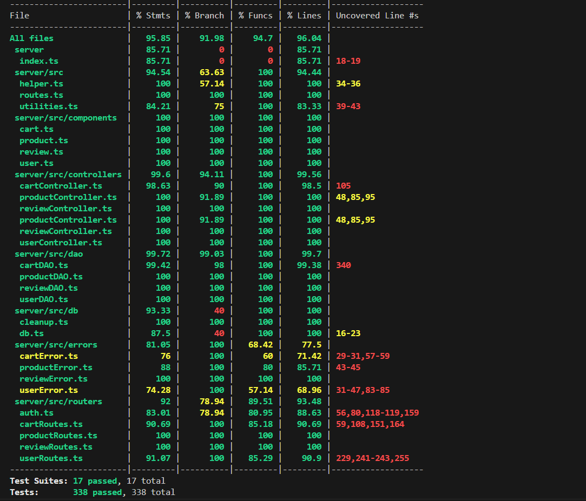

# Test Report

# Contents

- [Test Report](#test-report)
- [Contents](#contents)
- [Dependency graph](#dependency-graph)
- [Integration approach](#integration-approach)
- [Tests](#tests)
- [Coverage](#coverage)
  - [Coverage of FR](#coverage-of-fr)
  - [Coverage white box](#coverage-white-box)

# Dependency graph

# Integration approach

Gli Unit test sono stati fatti in base alle API. Abbiamo 4 componenti (products, user, cart e review) con i corrispettivi DAO, Controller e Route.

Per ciascuna delle componenti sono stati realizzati test che verificano la validità di ciascun pezzo di codice del singolo componente implementato.

Ciascun unit test è stato fatto partendo dal DAO proseguendo con il controller e finendo con le route (stesso approccio con il quale il codice è stato realizzato), facendo il mock di ogni singolo componente esterno chiamato.

Una volta passati gli unit test, si è proseguito alla realizzazione degli integration test dove si è chiamato le API delle route, verificando tutti i casi richiesti.

# Tests

## Route products

|       Test case name        |                                  Object(s) tested                                   | Test level | Technique used |
| :-------------------------: | :---------------------------------------------------------------------------------: | :--------: | :------------: |
|       POST /products        |                             route inserimento products                              |    Unit    |    WhiteBox    |
|   PATCH /products/:model    |                route per aumentare la quantità di un set di prodotti                |    Unit    |    WhiteBox    |
| PATCH /products/:model/sell |               route per vendere una determinata quantit' di prodotti                |    Unit    |    WhiteBox    |
|        GET /products        |       route per ottenere i prodotti nel db con filtro per categoria e modello       |    Unit    |    WhiteBox    |
|   GET /products/available   | route per ottenere i prodotti disponibili del db con filtro per categoria e modello |    Unit    |    WhiteBox    |
|   DELETE /products/:model   |                       route per cancellare un prodotto dal db                       |    Unit    |    WhiteBox    |
|      DELETE /products       |                    route per cancellare tutti i prodotti dal db                     |    Unit    |    WhiteBox    |

## Route reviews

|       Test case name       |                                      Object(s) tested                                       | Test level | Technique used |
| :------------------------: | :-----------------------------------------------------------------------------------------: | :--------: | :------------: |
|    POST /reviews/:model    |            route per aggiungere una review a un prodotto acquistato da un utente            |    Unit    |    WhiteBox    |
|    GET /reviews/:model     |                route per ottenere tutte le review di uno specifico prodotto                 |    Unit    |    WhiteBox    |
|   DELETE /reviews/:model   | route per cancellare una singola review fatta su uno specifico prodotto dall'utente loggato |    Unit    |    WhiteBox    |
| DELETE /reviews/:model/all |            route per cancellare tutte le review fatta su uno specifico prodotto             |    Unit    |    WhiteBox    |
|      DELETE /reviews       |               route per cancellare tutte le review fatta su tutti i prodotti                |    Unit    |    WhiteBox    |

## Route users

|     Test case name      |                       Object(s) tested                        | Test level | Technique used |
| :---------------------: | :-----------------------------------------------------------: | :--------: | :------------: |
|       POST /users       |                  route per creare un utente                   |    Unit    |    WhiteBox    |
|       GET /users        |              route per ottenere tutti gli utenti              |    Unit    |    WhiteBox    |
|    GET /users/roles     |  route per ottenere tutti gli utenti di uno specifico ruolo   |    Unit    |    WhiteBox    |
|  GET /users/:username   | route per ottenere un singolo user con uno specifico username |    Unit    |    WhiteBox    |
| DELETE /users/:username |           route per eliminare uno specifico utente            |    Unit    |    WhiteBox    |
|      DELETE /users      |             route per eliminare tutti gli utenti              |    Unit    |    WhiteBox    |
| PATCH /users/:username  |           route per aggiornare i dati di un utente            |    Unit    |    WhiteBox    |

## Route carts

|        Test case name         |                                Object(s) tested                                | Test level | Technique used |
| :---------------------------: | :----------------------------------------------------------------------------: | :--------: | :------------: |
|          POST /carts          |           route per aggiungere un'istanza di un prodotto al carrello           |    Unit    |    WhiteBox    |
|          GET /carts           |         route per ottenere il carrello non pagato dell'utente loggato          |    Unit    |    WhiteBox    |
|      GET /carts/history       |     route per ottenere lo storico dei carrelli pagati dell'utente loggato      |    Unit    |    Whitebox    |
|        GET /carts/all         |            route per ottenere tutti i carrelli di tutti gli utenti             |    Unit    |    Whitebox    |
|         PATCH /carts          |        route per simulare il pagamento del carrello dell'utente loggato        |    Unit    |    Whitebox    |
|         DELETE /carts         |                     route per cancellare tutti i carrelli                      |    Unit    |    Whitebox    |
|     DELETE /carts/current     |                    route per svuotare il carrello corrente                     |    Unit    |    Whitebox    |
| DELETE /carts/products/:model | route per rimuovere un'istanza di un prodotto dal carrello dell'utente loggato |    Unit    |    Whitebox    |

## Controller products

|         Test case name          |                                                              Object(s) tested                                                              | Test level | Technique used |
| :-----------------------------: | :----------------------------------------------------------------------------------------------------------------------------------------: | :--------: | :------------: |
|     Registrazione prodotto      |          Test che registra un prodotto e verifica se il prodotto esiste già, lo aggiunge se non esiste, controlla errori di data           |    Unit    |    WhiteBox    |
|         Cambio quantità         |                           Test che cambia la quantità di prodotto con controllo prodotto inesistente/errori data                           |    Unit    |    WhiteBox    |
|        Vendita prodotto         | Test che vende il prodotto con controllo che il prodotto esiste, se è disponibile nella quantità richiesta ed errori sulle date di aquisto |    Unit    |    WhiteBox    |
|        Cancella prodotto        |                                     Test che cancella un prodotto con verifica che il prodotto esista                                      |    Unit    |    WhiteBox    |
|    Cancella tutti i prodotti    |                                         Test che cancella tutti i prodotti con verifica di errori                                          |    Unit    |    WhiteBox    |
|       Visualizza prodotti       |                    Test che restituisce prodotti in base alla categoria o al modello e verifica che il prodotto esista                     |    Unit    |    WhiteBox    |
| Visualizza prodotti disponibili |                    Test che restituisce i prodotti disponibili in base al modello o alla categoria con controllo errori                    |    Unit    |    WhiteBox    |

## Controller carts

|                    Test case name                    |                                                                                         Object(s) tested                                                                                          | Test level | Technique used |
| :--------------------------------------------------: | :-----------------------------------------------------------------------------------------------------------------------------------------------------------------------------------------------: | :--------: | :------------: |
|         Aggiunta nuovo prodotto al carrello          |                                                 Test che verifica che il prodotto da aggiungere sia valido e disponibile (quantità in stock > 0)                                                  |    Unit    |    WhiteBox    |
| Visualizzazione carrello corrente e carrelli passati |                                Test che verifica la visualizzazione del carrello corrente (eventualmente vuoto) e dei carrelli passati (eventualmente inesistenti)                                |    Unit    |    WhiteBox    |
|           Rimozione prodotto dal carrello            |                                                       Test che verifica che il prodotto da rimuovere sia valido e all'interno del carrello                                                        |    Unit    |    WhiteBox    |
|                 Svuotamento carrello                 |                                                                             Test che verifica che il carrello esiste                                                                              |    Unit    |    WhiteBox    |
|    Cancellazione dei carrelli di tutti gli utenti    |                                                                          Test per verificare la funzionalità specificata                                                                          |    Unit    |    WhiteBox    |
|                  Checkout carrello                   | Test che verifica l'esistenza del carrello, che non deve essere vuoto. Se almeno una quantità richiesta di un prodotto nel carrello supera la quantità disponibile in stock, il checkout fallisce |    Unit    |    WhiteBox    |

## Controller reviews

|            Test case name             |                                       Object(s) tested                                        | Test level | Technique used |
| :-----------------------------------: | :-------------------------------------------------------------------------------------------: | :--------: | :------------: |
|            Aggiunta review            |          Test che aggiunge una review con verifica che non esista già ed errore DAO           |    Unit    |    WhiteBox    |
|  Visualizzazione prodotti con review  |             Test che restituisce i prodotti con review e verifica errori nel DAO              |    Unit    |    WhiteBox    |
|     Cancellazione review prodotto     | Test che cancella le review di un prodotto verificando errori del dao e di review inesistente |    Unit    |    WhiteBox    |
| Cancellazione review tutti i prodotti |                        Test che cancella le review di tutti i prodotti                        |    Unit    |    WhiteBox    |

## Controller users

|            Test case name            |                                 Object(s) tested                                  | Test level | Technique used |
| :----------------------------------: | :-------------------------------------------------------------------------------: | :--------: | :------------: |
|           Creazione utente           |                              Test che crea un utente                              |    Unit    |    WhiteBox    |
|        Visualizzazione Utenti        |                            Test che restituisce utente                            |    Unit    |    WhiteBox    |
|     Visualizzazione Utenti Ruolo     |  Test che restituisce gli utenti di un ruolo specifico e verifica errore del DAO  |    Unit    |    WhiteBox    |
| Visualizzazione utenti dato username |    Test che restituisce un utente dato il suo username, verifa errore del DAO     |    Unit    |    WhiteBox    |
|          Verifica username           |                 Test che verifica se l'username è già in uso o no                 |    Unit    |    WhiteBox    |
|         Cancellazione utente         |          Test che cancella un user utente, verificando un errore nel dao          |    Unit    |    WhiteBox    |
|      Cancellazione tutti utenti      | Test che cancella tutti gli utenti, verifica errore del dao e che ci siano utenti |    Unit    |    WhiteBox    |
|         Modifica dati utente         |                       Test che modifica i dati di un utente                       |    Unit    |    WhiteBox    |

## DAO products

|      Test case name      |                                                                       Object(s) tested                                                                       | Test level | Technique used |
| :----------------------: | :----------------------------------------------------------------------------------------------------------------------------------------------------------: | :--------: | :------------: |
|   Inserimento prodotti   |                                  Test che registra prodotti, verifica che non esista già e che non abbia parametri invalidi                                  |    Unit    |    WhiteBox    |
|  Cancellazione prodotti  | Test che cancella tutti i prodotti o un singolo prodotto specifico, verifica se il prodotto da cancellare esiste e se la cancellazione avviene correttamente |    Unit    |    WhiteBox    |
|  Aggiornamento prodotti  |                                              Test che aggiorna un prodotto e ne verifica la corretta esecuzione                                              |    Unit    |    WhiteBox    |
| Visualizzazione prodotti |          Test che visualizza un prodotto dato il modello, tutti i prodotti, verifica errori e se ci sono prodotti e se il modello richiesto esiste           |    Unit    |    WhiteBox    |

## DAO carts

|              Test case name              |                                                                             Object(s) tested                                                                              | Test level | Technique used |
| :--------------------------------------: | :-----------------------------------------------------------------------------------------------------------------------------------------------------------------------: | :--------: | :------------: |
|         Visualizzazione carrelli         |                                                         Test che restituisce tutti i carrelli di tutti gli utenti                                                         |    Unit    |    WhiteBox    |
|  Visualizzazione carrelli dato username  |                                                       Test che restituisce tutti i carrelli di un utente specifico                                                        |    Unit    |    WhiteBox    |
|    Visualizzazione carrello corrente     |                                                     Test che restituisce il carrello corrente di un utente specifico                                                      |    Unit    |    WhiteBox    |
|   Visualizzazione ID carrello corrente   |                                                  Test che restituisce l'ID del carrello corrente di un utente specifico                                                   |    Unit    |    WhiteBox    |
|     Inserimeto prodotto nel carrello     |                                                        Test che inserisce un un prodotto nel carrello di un utente                                                        |    Unit    |    WhiteBox    |
|            Creazione carrello            |                                                         Test che crea un nuovo carrello per l'utente specificato                                                          |    Unit    |    WhiteBox    |
|            Checkout carrello             |                                                              Test per il checkout del carrello di un utente                                                               |    Unit    |    WhiteBox    |
| Visualizzazione ID prodotto dato modello |                                                         Test per visualizzare l'id di un prodotto dato il modello                                                         |    Unit    |    WhiteBox    |
|   Aggiornamento prodotto nel carrello    |                                                   Test per aggiornare la quantità di un specifico prodotto del carrello                                                   |    Unit    |    WhiteBox    |
|   Cancellazione prodotto nel carrello    |                                                           Test per cancellare un prodotto presente nel carrello                                                           |    Unit    |    WhiteBox    |
|      Cancellazione carrello utente       |                                                          Test per cancellare un carrello di un utente specifico                                                           |    Unit    |    WhiteBox    |
|          Cancellazione carrelli          |                                                         Test per cancellare tutti i carrelli di tutti gli utenti                                                          |    Unit    |    WhiteBox    |
| Modifica quantità prodotto nel carrello  | Test per la gestione approfondita dei prodotti nel carrello. Include la sua creazione, l'inserimento o la cancellazione di un nuovo prodotto e la modifica della quantità |    Unit    |    WhiteBox    |
| Aggiunta/Rimozione prodotto nel carrello |                                                   Test per l'aggiunta e la rimozione di prodotti esistenti nel carrello                                                   |    Unit    |    WhiteBox    |
|     Rimozione prodotto dal carrello      |                                                                Test per rimuovere un prodotto dal carrello                                                                |    Unit    |    WhiteBox    |

## DAO reviews

|               Test case name               |                                                                  Object(s) tested                                                                  | Test level | Technique used |
| :----------------------------------------: | :------------------------------------------------------------------------------------------------------------------------------------------------: | :--------: | :------------: |
|      Visualizzazione review prodotto       |                        Test che restituisce tutte le review di un prodotto dato il suo modello e verifica eventuali errori                         |    Unit    |    WhiteBox    |
|       Aggiungere review al prodotto        | Test che aggiunge una review a un prodotto, verifica l'aggiunta corretta, che il prodotto sia presente tra quelli del cart acquistati e che esista |    Unit    |    WhiteBox    |
| Cancellazione Review dato utente e modello |      Test che cancella la review di un dato utente su uno specifico prodotto, verifica che sia cancellata, fallimenti e che la review esista       |    Unit    |    WhiteBox    |
| Cancellazione review dato modello prodotto |                Test che cancella le review di un dato prodotto, verifica che siano cancellate, altri errori, che il prodotto esista                |    Unit    |    WhiteBox    |
|         Cancellazione tutte review         |                                     Test che cancella le review di tutti i prodotti, verifica errori generici                                      |    Unit    |    WhiteBox    |

## DAO users

|           Test case name           |                                                               Object(s) tested                                                               | Test level | Technique used |
| :--------------------------------: | :------------------------------------------------------------------------------------------------------------------------------------------: | :--------: | :------------: |
| Visualizzazione utenti autenticati | Test che restituisce se un utente è autenticato, che la password sia valida, che non ci sia un utente con lo stesso username o errori nel db |    Unit    |    WhiteBox    |
|          Creazione utenti          |                           Test che crea un utente, verifica che l'utente non esista e che non ci sia errori nel db                           |    Unit    |    WhiteBox    |
|  Visualizza utenti dato username   |               Test che visualizza utenti dato un username, verifica che l'username fornito esista e non ci siano errori nel db               |    Unit    |    WhiteBox    |
|       Visualizzazione utenti       |                                    Test che restituisce gli user, verifica che ci siano ed errori nel db                                     |    Unit    |    WhiteBox    |
|          Cancella utente           |                         Test che cancella un utente specifico, verifica che esiste e che non ci siano errori nel db                          |    Unit    |    WhiteBox    |
|     Cancella tutti gli utenti      |                         Test che cancella tutti gli utenti, verifica che ci siano user e non ci siano errori nel db                          |    Unit    |    WhiteBox    |
|     Aggiornamento dati utenti      |                     Test che aggiorna i dati di un utente, verifica che esista l'utente e che non ci siano errori nel db                     |    Unit    |    WhiteBox    |

## Integration tests

|               Test case name                | Object(s) tested | Test level | Technique used |
| :-----------------------------------------: | :--------------: | :--------: | :------------: |
|               POST /products                |  ProductRoutes   |    API     |    BlackBox    |
|           PATCH /products/:model            |  ProductRoutes   |    API     |    BlackBox    |
|         PATCH /products/:model/sell         |  ProductRoutes   |    API     |    BlackBox    |
|                GET /products                |  ProductRoutes   |    API     |    BlackBox    |
|           GET /products/available           |  ProductRoutes   |    API     |    BlackBox    |
|           DELETE /products/:model           |  ProductRoutes   |    API     |    BlackBox    |
|            POST /reviews/:model             |   ReviewRoutes   |    API     |    BlackBox    |
|             GET /reviews/:model             |   ReviewRoutes   |    API     |    BlackBox    |
|           DELETE /reviews/:model            |   ReviewRoutes   |    API     |    BlackBox    |
|         DELETE /reviews/:model/all          |   ReviewRoutes   |    API     |    BlackBox    |
|               DELETE /reviews               |   ReviewRoutes   |    API     |    BlackBox    |
|                 POST /users                 |    UserRoutes    |    API     |    BlackBox    |
|                 GET /users                  |    UserRoutes    |    API     |    BlackBox    |
|           GET /users/roles/:role            |    UserRoutes    |    API     |    BlackBox    |
|            GET /users/:username             |    UserRoutes    |    API     |    BlackBox    |
|           DELETE /users/:username           |    UserRoutes    |    API     |    BlackBox    |
|               DELETE /users/                |    UserRoutes    |    API     |    BlackBox    |
|           PATCH /users/:username            |    UserRoutes    |    API     |    BlackBox    |
|          POST /ezelectronics/carts          |    CartRoutes    |    API     |    BlackBox    |
|          GET /ezelectronics/carts           |    CartRoutes    |    API     |    BlackBox    |
|      GET /ezelectronics/carts/history       |    CartRoutes    |    API     |    BlackBox    |
|        GET /ezelectronics/carts/all         |    CartRoutes    |    API     |    BlackBox    |
|         PATCH /ezelectronics/carts          |    CartRoutes    |    API     |    BlackBox    |
| DELETE /ezelectronics/carts/products/:model |    CartRoutes    |    API     |    BlackBox    |
|     DELETE /ezelectronics/carts/current     |    CartRoutes    |    API     |    BlackBox    |
|         DELETE /ezelectronics/carts         |    CartRoutes    |    API     |    BlackBox    |

# Coverage

## Coverage of FR

<Report in the following table the coverage of functional requirements and scenarios(from official requirements) >

|                    Functional Requirement or scenario                    |                   Test(s)                   |
| :----------------------------------------------------------------------: | :-----------------------------------------: |
|                              FR1.1 - Login                               |        POST /ezelectronics/sessions         |
|                              FR1.2 - Logout                              |   DELETE /ezelectronics/sessions/current    |
|                    FR1.3 - Create a new user account                     |          POST /ezelectronics/users          |
|                    FR2.1 - Show the list of all users                    |          GET /ezelectronics/users           |
|         FR2.2 - Show the list of all users with a specific role          |    GET /ezelectronics/users/roles/:role     |
|              FR2.3 - Show the information of a single user               |     GET /ezelectronics/users/:username      |
|             FR2.4 - Update the information of a single user              |    PATCH /ezelectronics/users/:username     |
|                 FR2.5 - Delete a single _non Admin_ user                 |    DELETE /ezelectronics/users/:username    |
|                   FR2.6 - Delete all _non Admin_ users                   |         DELETE /ezelectronics/users         |
|                  FR3.1 - Register a set of new products                  |        POST /ezelectronics/products         |
|                 FR3.2 - Update the quantity of a product                 |    PATCH /ezelectronics/products/:model     |
|                          FR3.3 - Sell a product                          |  PATCH /ezelectronics/products/:model/sell  |
|                  FR3.4 - Show the list of all products                   |         GET /ezelectronics/products         |
|            FR3.4.1 - Show the list of all available products             |    GET /ezelectronics/products/available    |
|       FR3.5 - Show the list of all products with the same category       |         GET /ezelectronics/products         |
| FR3.5.1 - Show the list of all available products with the same category |    GET /ezelectronics/products/available    |
|        FR3.6 - Show the list of all products with the same model         |         GET /ezelectronics/products         |
|  FR3.6.1 - Show the list of all available products with the same model   |    GET /ezelectronics/products/available    |
|                         FR3.7 - Delete a product                         |    DELETE /ezelectronics/products/:model    |
|                       FR3.8 - Delete all products                        |       DELETE /ezelectronics/products        |
|                  FR4.1 - Add a new review to a product                   |     POST /ezelectronics/reviews/:model      |
|        FR4.2 - Get the list of all reviews assigned to a product         |      GET /ezelectronics/reviews/:model      |
|                FR4.3 - Delete a review given to a product                |    DELETE /ezelectronics/reviews/:model     |
|                 FR4.4 - Delete all reviews of a product                  |  DELETE /ezelectronics/reviews/:model/all   |
|                FR4.5 - Delete all reviews of all products                |        DELETE /ezelectronics/reviews        |
|             FR5.1 - Show the information of the current cart             |          GET /ezelectronics/carts           |
|                FR5.2 - Add a product to the current cart                 |          POST /ezelectronics/carts          |
|                    FR5.3 - Checkout the current cart                     |         PATCH /ezelectronics/carts          |
|                FR5.4 - Show the history of the paid carts                |      GET /ezelectronics/carts/history       |
|              FR5.5 - Remove a product from the current cart              | DELETE /ezelectronics/carts/products/:model |
|                     FR5.6 - Delete the current cart                      |     DELETE /ezelectronics/carts/current     |
|              FR5.7 - See the list of all carts of all users              |        GET /ezelectronics/carts/all         |
|                         FR5.8 - Delete all carts                         |         DELETE /ezelectronics/carts         |

## Coverage white box

Report here the screenshot of coverage values obtained with jest-- coverage

The following coverage stats has been generated by this npm command:

> npm test -- --coverage

